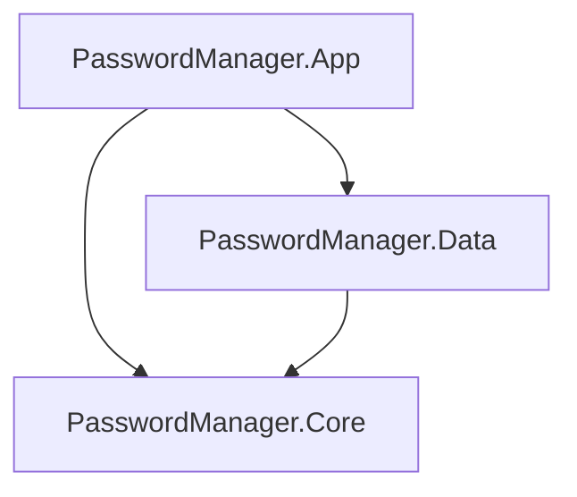
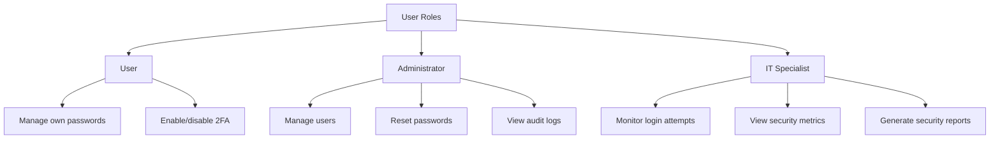
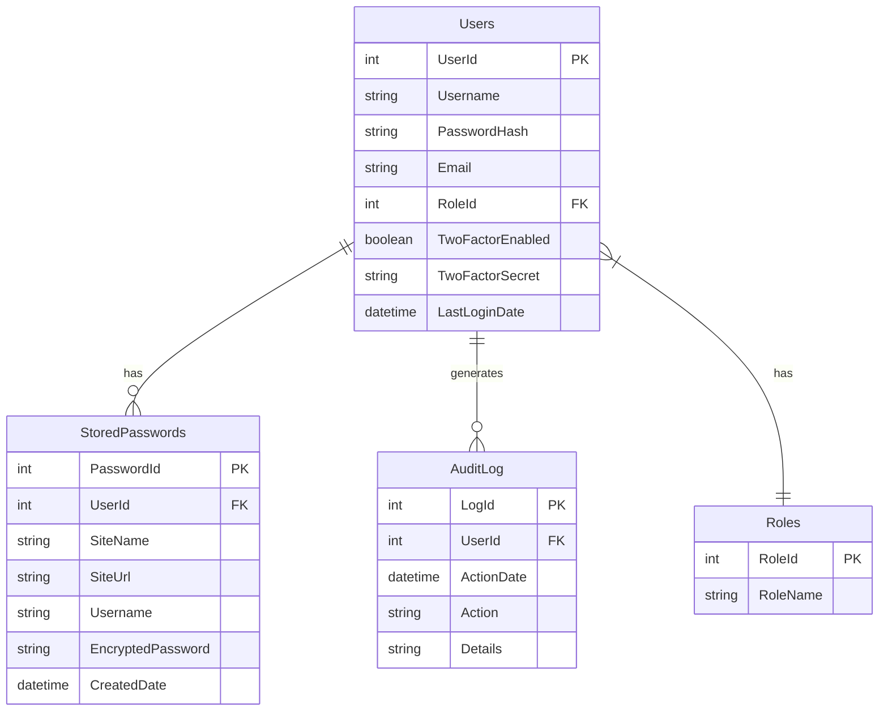

# Password Manager

A secure, multi-user password management application built with C# WPF using LINQ to SQL and following the MVVM pattern. The application demonstrates essential security features including password encryption, two-factor authentication, and role-based access control.

## Technologies Used

- **Framework**: .NET Framework 4.8
- **UI**: Windows Presentation Foundation (WPF)
- **Architecture**: Model-View-ViewModel (MVVM)
- **Database**: Microsoft SQL Server with LINQ to SQL
- **Security**: AES encryption, PBKDF2 password hashing, TOTP-based 2FA

## Project Structure

The solution consists of three projects with clear separation of concerns:



### PasswordManager.Core
- Contains core business logic and interfaces
- Defines models and service interfaces
- Implements security services and MVVM base classes
- Has no dependencies on other projects

### PasswordManager.Data
- Handles data access using LINQ to SQL
- Implements repository pattern
- References only PasswordManager.Core
- Contains database mappings and configurations

### PasswordManager.App
- WPF user interface implementation
- Contains Views and ViewModels
- References both Core and Data projects
- Implements UI-specific converters and services

## Security Features

### Password Encryption
- Uses AES encryption for stored passwords
- Implements secure key management
- Example from `EncryptionService.cs`:
```csharp
public string Encrypt(string plainText)
{
    using (Aes aes = Aes.Create())
    {
        aes.Key = Convert.FromBase64String(_key);
        aes.IV = _iv;
        ICryptoTransform encryptor = aes.CreateEncryptor(aes.Key, aes.IV);
        // ... encryption implementation
    }
}
```

### Two-Factor Authentication
- TOTP-based 2FA using standard algorithms
- QR code generation for easy setup
- Secure secret key management
- Example usage from `SecurityService.cs`:
```csharp
public bool ValidateTwoFactorCode(string secretKey, string code)
{
    var keyBytes = Base32Encoding.ToBytes(secretKey);
    var totp = new Totp(keyBytes);
    return totp.VerifyTotp(code, out long timeStepMatched, window);
}
```

## Role-Based Access

The application supports three user roles:



### Role-Specific Features
- **User**: Basic password management and 2FA setup
- **Administrator**: User management and system auditing
- **IT Specialist**: Security monitoring and threat analysis

## MVVM Implementation

### ViewModels
Each major feature has its own ViewModel inheriting from `ViewModelBase`:
```csharp
public abstract class ViewModelBase : INotifyPropertyChanged
{
    public event PropertyChangedEventHandler PropertyChanged;
    protected virtual void OnPropertyChanged([CallerMemberName] string propertyName = null)
    {
        PropertyChanged?.Invoke(this, new PropertyChangedEventArgs(propertyName));
    }
}
```

### Commands
Uses `RelayCommand` for MVVM command pattern implementation:
```csharp
public class RelayCommand : ICommand
{
    private readonly Action<object> _execute;
    private readonly Func<object, bool> _canExecute;
    
    public RelayCommand(Action<object> execute, Func<object, bool> canExecute = null)
    {
        _execute = execute ?? throw new ArgumentNullException(nameof(execute));
        _canExecute = canExecute;
    }
}
```

## Database Schema



## Repository Pattern

The application implements the repository pattern for data access:

```csharp
public interface IStoredPasswordRepository
{
    StoredPasswordModel GetById(int passwordId);
    IEnumerable<StoredPasswordModel> GetByUserId(int userId);
    void Create(StoredPasswordModel password);
    void Update(StoredPasswordModel password);
    void Delete(int passwordId);
}
```

## Getting Started

1. Create the database using the provided SQL scripts
2. Update the connection string in `App.config`
3. Generate an encryption key using the provided utility
4. Build and run the application

## Key Features

1. **Password Management**
   - Secure storage of passwords
   - Password generation
   - Password strength evaluation
   - Password expiration tracking

2. **Security Monitoring**
   - Failed login tracking
   - Suspicious activity detection
   - Audit logging
   - Security metrics dashboard

3. **User Administration**
   - User account management
   - Role assignment
   - Password reset functionality
   - Activity monitoring

## Best Practices Demonstrated

1. **Separation of Concerns**
   - Clear project structure
   - MVVM pattern implementation
   - Repository pattern for data access

2. **Security**
   - Secure password storage
   - Two-factor authentication
   - Encryption for sensitive data
   - Audit logging

3. **SOLID Principles**
   - Interface segregation
   - Dependency injection
   - Single responsibility

4. **Code Organization**
   - Consistent naming conventions
   - Clear folder structure
   - Proper use of interfaces
   - Service-based architecture
